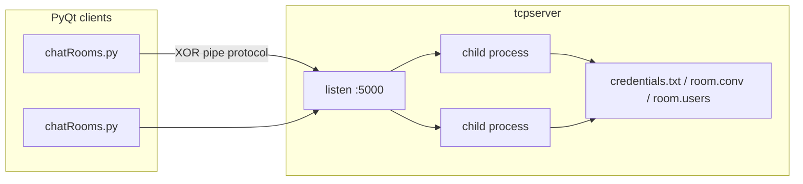

# Chatbook

Desktop chat rooms for the distributed computing class: a **C TCP server** (one forked process per client) and a **PyQt5** client. Messages and commands use a simple pipe-delimited protocol with XOR obfuscation.

## Features

- Sign in, register, and log out
- Create chat rooms, join existing rooms, and send messages
- Admin view to add or remove members of the open room
- Multi-client server with `fork()`, reusable bind, and a configurable port

## Architecture



Each client holds one TCP connection. The parent process accepts connections and forks; the child handles that socket until disconnect. Chat history lives in `<room>.conv` and membership in `<room>.users` next to the server binary.

## Requirements

- GCC (C11-capable)
- Python 3.8+
- PyQt5

```bash
python3 -m pip install -r requirements.txt
```

On Debian/Ubuntu you can also install the system package:

```bash
sudo apt install python3-pyqt5 gcc make
```

## Run

Start the server from the `server` directory so it can read `credentials.txt` and write room files:

```bash
make -C server
cd server
./tcpserver          # default port 5000
./tcpserver 5000     # optional explicit port
```

In another terminal, from the project root:

```bash
python3 chatRooms.py
```

To point the client at another host or port:

```bash
CHATBOOK_HOST=127.0.0.1 CHATBOOK_PORT=5000 python3 chatRooms.py
```

## Demo accounts

| Username | Password |
|----------|----------|
| `root`   | `admin`  |
| `user1`  | `password` |
| `user`   | `pass`   |
| `asti`   | `fresh`  |
| `pablo`  | `lock!user` |

## Protocol

Commands are `name|payload`, XOR'd with the byte `K`, then sent as Latin-1. The same XOR is applied to the reply.

| Command | Payload after `name\|` | Result |
|---------|------------------------|--------|
| `auth` | `user\|password` | `Granted` / `Denied` |
| `registrarUsuario` | `user\|password` | success or `Error\|…` |
| `getUsers` | _(empty)_ | `user1\|user2\|…` |
| `getAllChatrooms` | _(empty)_ | `room1\|room2\|…` |
| `getUserChatrooms` | `user` | rooms that user belongs to |
| `getAdminChat` | `user` | rooms that user created |
| `createChatRoom` | `user\|room` | `user\|room\|True` |
| `addUser` | `user\|room` | `user\|room\|Added` |
| `deleteUser` | `user\|room` | `user\|room\|Deleted` |
| `getChat` | `room` | conversation text |
| `getChatUsers` | `room` | members of the room |
| `messageSent` | `user->text\|room` | `Message sent!` |

XOR with a single-byte key is **not encryption**. It is only there to illustrate a transform on the wire.

## Project layout

```
chatRooms.py          # main PyQt client
Login.ui / Register.ui / MainWindow.ui / MainWindowAdmin.ui
createChatRoom.ui / error.ui
style.qss             # shared theme
utilities.py          # XOR helper
server/tcpserver.c    # TCP server
server/credentials.txt
tests/                # unit + protocol tests
```

`loginPyQt.py` and `server/client.py` are leftover prototypes; use `chatRooms.py`.

## Tests

```bash
make -C server
python3 -m unittest discover -s tests -v
```

## License

Course project — use and modify for learning.
